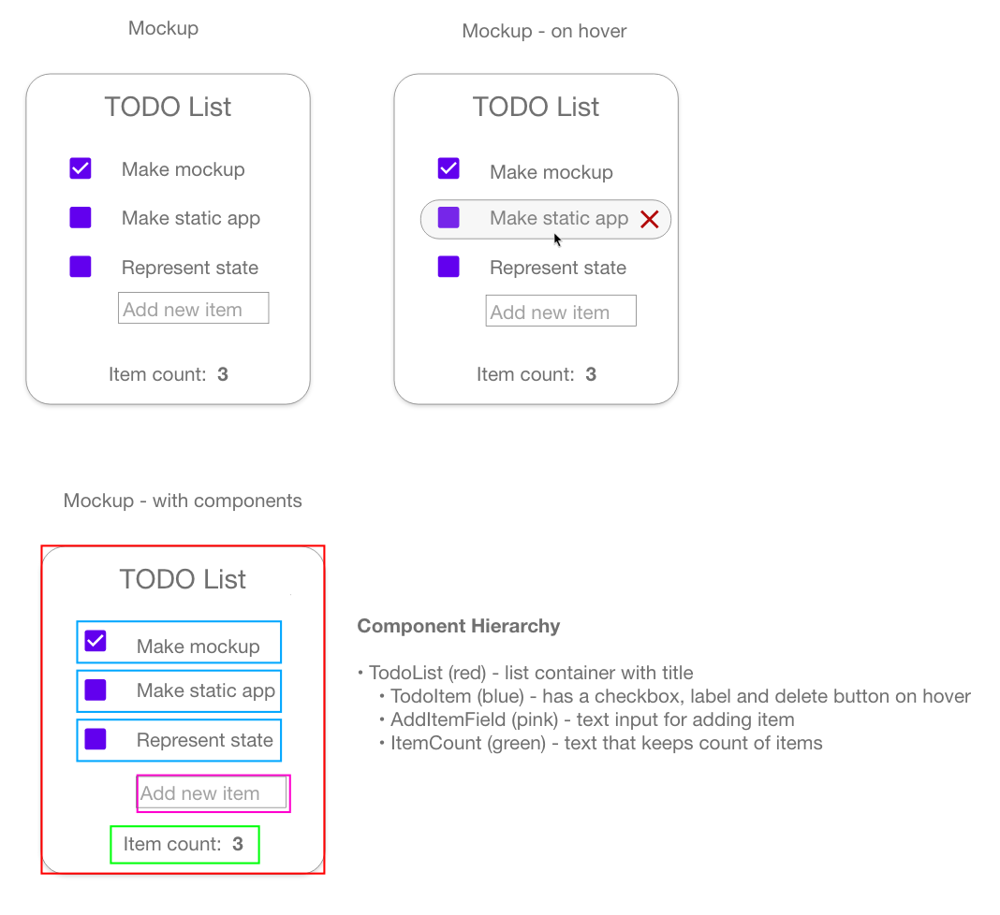

# Lab 7a

## Mockup and component hierarchy

## Minimal representation of state

Each checkbox has checked/unchecked state, but this state does not need to be "seen" by another component
so it can live locally in the checkbox components themselves.

The AddItemField has the user's text input as its local state. When the user presses enter, the current state will
be the argument to a function that creates a new TodoItem.

The total number of items can be implemented as a simple counter. It will live in the main TodoList component.
The setter function can be generated with the `useState()` hook and passed to the AddItemField component. Its value
can likewise be passed to the ItemCount component.

Thus, the state representation is:

- The value of each checkbox
- The text in the the "add new item" field
- The item count

(lab 7b note: when implementing I ended up putting the item components themselves into a state array and keeping
a "current id" state variable. This allows the TodoList component to keep track of which item to delete.)
